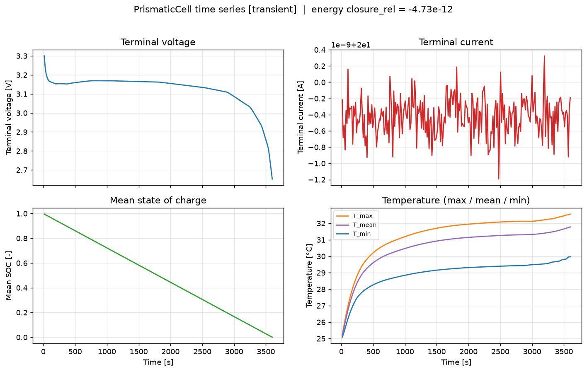
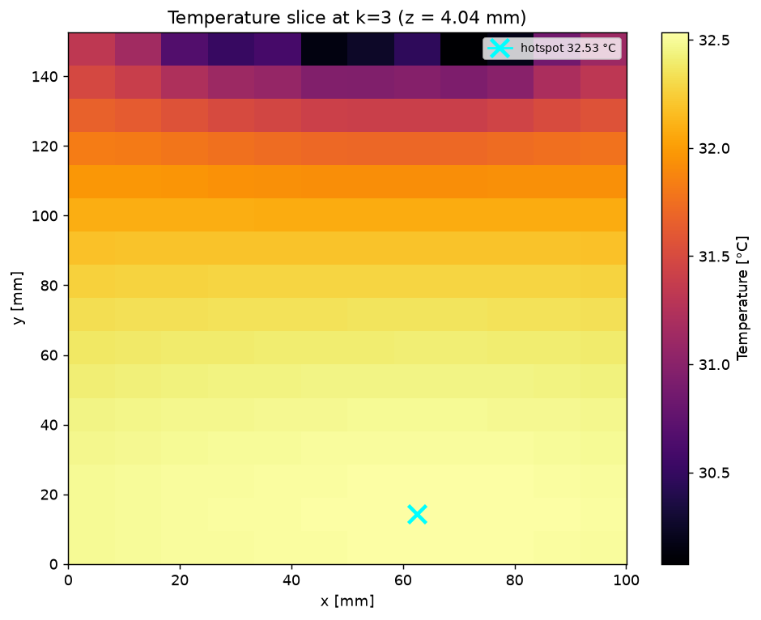
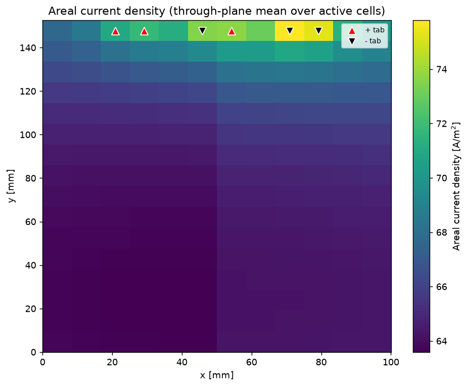
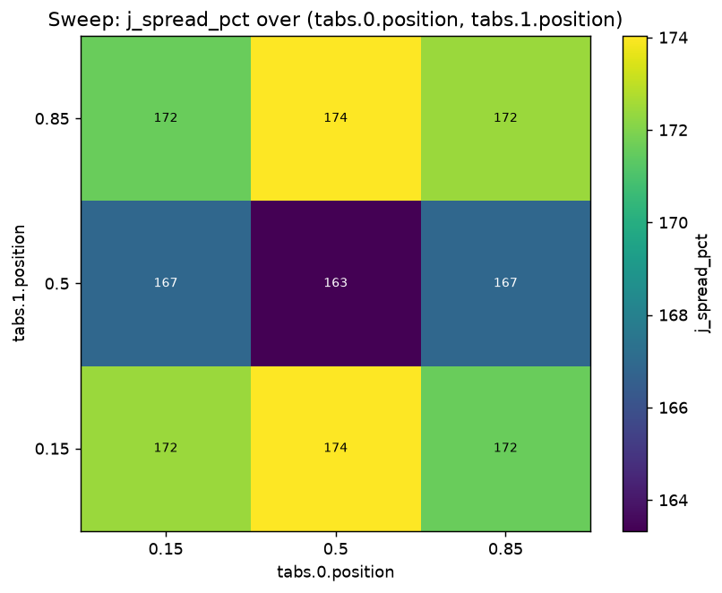
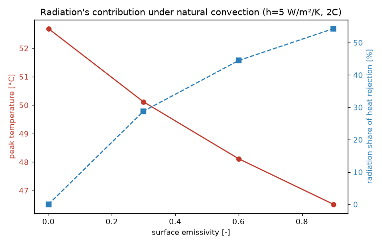

# PrismaticCell

A physics-based **distributed thermo-electrochemical model** for LFP (LiFePO₄ / artificial-
graphite) prismatic cells, built for **design exploration**: sweep stack dimensions, enclosure
type/thickness, electrode thicknesses, and tab placement, and read out heat generation, the 3-D
temperature field, thermal gradients/hotspots, and electrochemical performance.

## What it models

```
Prismatic cell (metal can)
 └─ 2 jellyrolls  (parallel to the tabs, thermally coupled through the can)
     └─ each jellyroll = many stacked sandwiches
         └─ sandwich = Cathode-CC | Cathode | Separator | Anode | Anode-CC
Control volumes = full 3-D structured grid → one ECM per active control volume
```

- **Distributed ECM network** — every active control volume runs its own equivalent-circuit
  model (OCV, R0, RC pairs, entropy) at its *local* SOC and temperature. CVs are networked
  through the Al/Cu **current-collector potential fields**, so **tab placement, electrode
  thickness and stack size actually redistribute current, SOC and heat**.
- **3-D anisotropic thermal solver** — finite-volume, transient (implicit) and steady-state,
  with independent per-face boundary conditions on the top, bottom and four side faces. Heat
  transfer covers **conduction** (anisotropic, everywhere), **convection** (external Newton
  cooling), and **radiation** (per-face `emissivity`, linearized Stefan–Boltzmann). Internal gaps
  are effective-conduction media (no resolved fluid flow).
- **Two collector fidelities** (`solver.collector_model`) — `planar` (2.5-D: one shared foil
  potential per jellyroll; fast) or `layered` (full 3-D collector: a separate foil potential per
  through-thickness stack layer, parallel at the tabs — resolves through-thickness potential
  gradients). Both conserve charge; `layered` → `planar` in the conductive-foil limit.
- **Two-way coupling** — Bernardi heat generation (irreversible + reversible + ohmic) feeds the
  thermal solver; the temperature field feeds back into the (Arrhenius) ECM parameters. A real
  closed loop, verified by an energy-conservation test.

Governing equations: [`docs/PHYSICS.md`](docs/PHYSICS.md).

## Install & run

```bash
pip install -e .            # numpy, scipy, matplotlib, pyyaml
prismaticcell run configs/baseline_prismatic.yaml          # run a simulation
python -m pytest                                           # validation suite
python examples/discharge_baseline.py                      # example + plots
python examples/tab_placement_sweep.py                     # design sweep + plots
```

## Layout

| Path | Purpose |
|------|---------|
| `prismaticcell/config.py`     | typed configuration schema (the shared contract) |
| `prismaticcell/materials.py`  | material DB + thermal homogenization |
| `prismaticcell/geometry.py`   | 3-D mesh, region map, tabs, enclosure |
| `prismaticcell/echem.py`      | per-CV ECM (OCV, R0, RC, entropy, SOC, Bernardi heat) |
| `prismaticcell/distributed.py`| collector-potential network + current distribution solve |
| `prismaticcell/thermal.py`    | 3-D anisotropic FVM (steady + transient) |
| `prismaticcell/coupling.py`   | two-way co-simulation driver + energy accounting |
| `prismaticcell/api.py`        | `Simulation` / `Sweep` high-level objects |
| `prismaticcell/viz.py`        | field slices, hotspot maps, time series, sweep heatmaps |
| `configs/`, `data/`           | example configs and (replaceable) LFP data tables |
| `tests/`, `examples/`         | analytical validations and runnable examples |

## Example results

Baseline 1C discharge (`examples/discharge_baseline.py`) — LFP voltage plateau with end knee,
exact 1C SOC ramp, and the characteristic double-hump temperature (hot at the SOC extremes where
resistance is high, cool on the flat plateau); global energy closes to ~1e-12:



In-plane temperature field with the hotspot marked, and the areal current-density map showing
current concentrating toward the tabs:




Design studies find real trade-offs: cooling a large face (top/bottom) holds ~44 °C vs ~61 °C for
a side face at 2C (`examples/cooling_comparison.py`); and because tabs carry a real series
resistance, tab placement strongly shapes the current-density spread (tens-of-percent to >150 %),
so opposite-end placement is preferable (`examples/tab_placement_sweep.py`).



Radiation matters when convection is weak: under natural convection (h=5 W/m²/K), raising surface
emissivity 0→0.9 drops peak temperature ~6 °C and grows radiation to ~54 % of total heat
rejection (`examples/cooling_comparison.py`):



## Validation

`python -m pytest` runs 31 checks (PHYSICS §7): 1-D steady conduction vs closed form, lumped-
capacitance transient, adiabatic-pulse and steady energy conservation, symmetric-cooling symmetry,
radiation energy balance, SOC Coulomb balance, Arrhenius direction, entropy sign, charge
conservation (planar & layered), discharge-below-OCV, the single-roll lumped limit, the layered
collector's through-thickness potential resolution, and end-to-end two-way-coupling energy closure.

Parameters and data tables are **representative** starting points — replace `data/*.csv` and
`configs/*.yaml` with your cell's characterization for quantitative design work.
